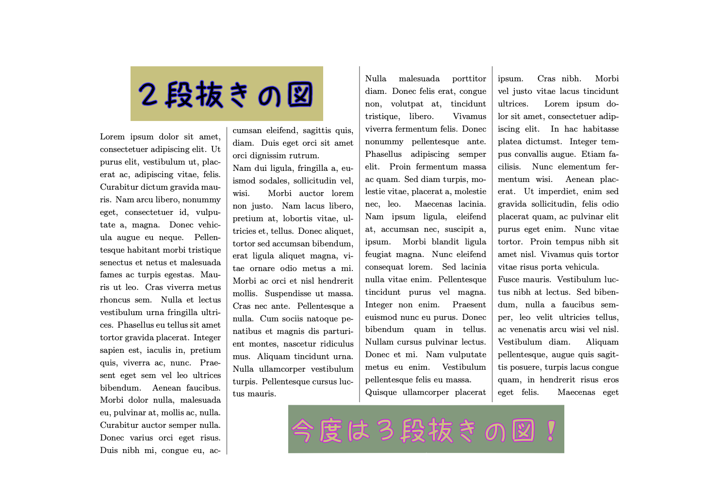

# ２段抜きと３段抜きの並存

これは，[TSG Advent Calendar 2020](https://adventar.org/calendars/4995)の20日目の記事です. 埋まってなかったので急遽.

さて，Twitterで，２段抜きと３段抜きの並存って大変だよね，という話を[見かけました](https://twitter.com/doraTeX/status/1339723056474775552).

そこで，LaTeXを用いた，２段抜きと３段抜きの並存サンプルをこのリポジトリに置いてみました. tcolorboxのmagazineライブラリを使うとまあまあらくにできます，という話です.

以上です.

